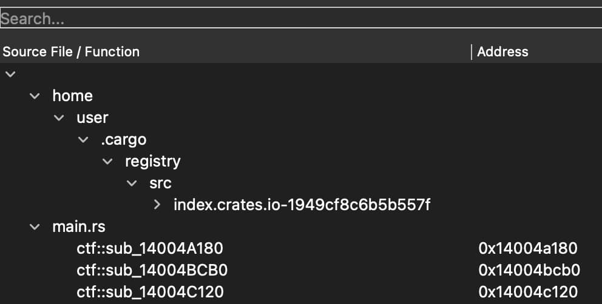
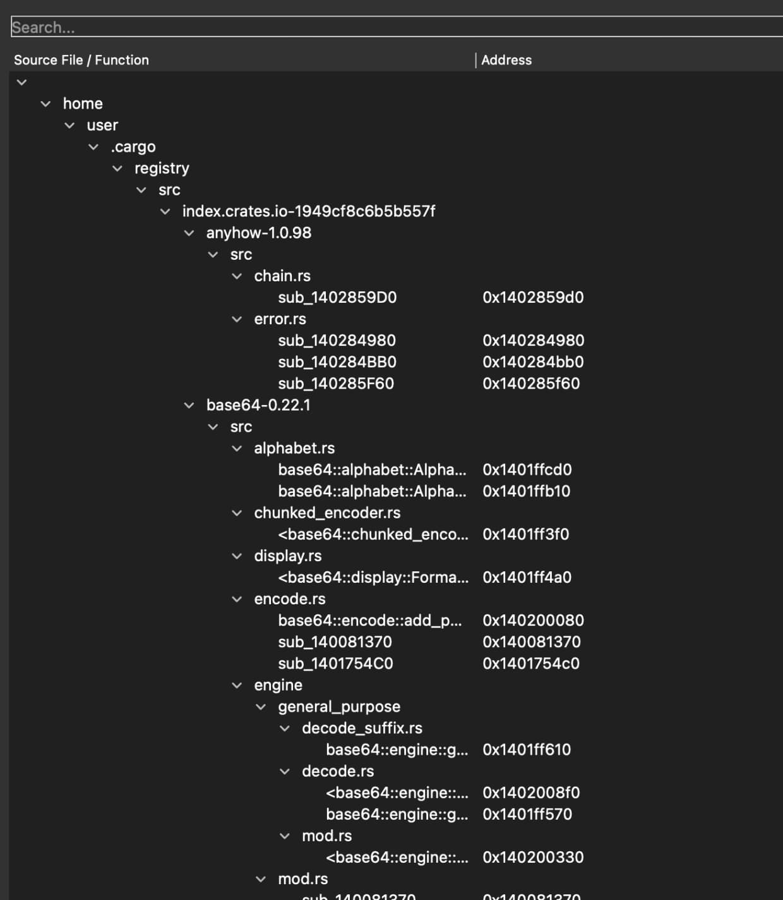
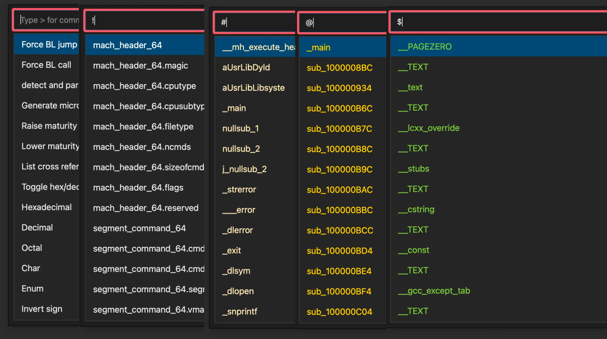

# idaplugins


* navigator.py
  > Provides shortcuts to navigate between functions and data items
  > j to go to next item, k to go to previous item
  ```
  wget -P ~/.idapro/plugins/ https://raw.githubusercontent.com/rand-tech/idaplugins/refs/heads/main/navigator.py
  ```

* funcfiletree.py
  > Display functions grouped by source file
  ```
  wget -P ~/.idapro/plugins/ https://raw.githubusercontent.com/rand-tech/idaplugins/refs/heads/main/funcfiletree.py
  ```


  
  

* icp.py
  > Command palette for IDA Pro
  ```
  wget -P ~/.idapro/plugins/ https://raw.githubusercontent.com/rand-tech/idaplugins/refs/heads/main/icp.py
  ```

  
